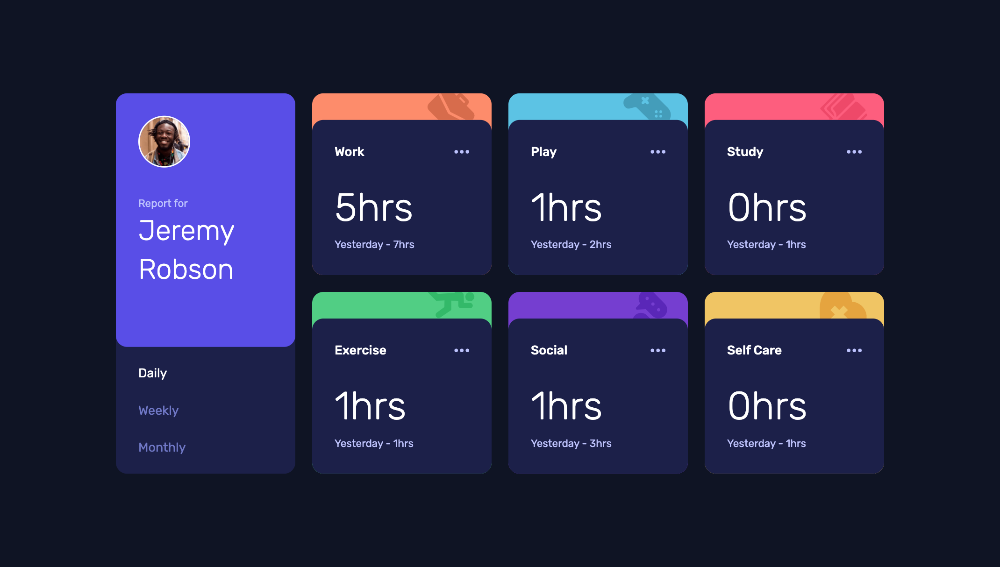

# Frontend Mentor - Time tracking dashboard solution

This is a solution to the [Time tracking dashboard challenge on Frontend Mentor](https://www.frontendmentor.io/challenges/time-tracking-dashboard-UIQ7167Jw). Frontend Mentor challenges help you improve your coding skills by building realistic projects. 

## Table of contents

- [Overview](#overview)
  - [The challenge](#the-challenge)
  - [Screenshot](#screenshot)
  - [Links](#links)
- [My process](#my-process)
  - [Built with](#built-with)
- [Author](#author)

## Overview

### The challenge

Users should be able to:

- View the optimal layout for the site depending on their device's screen size
- See hover states for all interactive elements on the page
- Switch between viewing Daily, Weekly, and Monthly stats

### Screenshot

### Links

- Solution URL: [https://bit.ly/3wWkT5D](https://www.frontendmentor.io/solutions/responsive-time-tracking-dashboard-using-angular-and-tailwind-LDWNsvzrAb)
- Live Site URL: [https://bit.ly/3QgIvsv](https://sensational-chimera-8046b2.netlify.app/)

## My process
- I started by decomposing the design in 2 types of components (report component and activity component)
- Then I built the report component
- After that built the activity component 
- At the end I had an angular app using the concepts of:
  - [x] Dependency injection
  - [x] Data sharing from parent to child component
  - [x] Data sharing from child to parent component

### Built with

- Semantic HTML5 markup
- Flexbox
- CSS Grid
- Mobile-first workflow
- [Angular](https://angular.io/) - Angular framework
- [Tailwind CSS](https://tailwindcss.com/) - For styles

## Author

- Website - [Lionel Traore](https://lioneltraore.com)
- Frontend Mentor - [@lioneltraore](https://www.frontendmentor.io/profile/lioneltraore)
- Twitter - [@traore_lionel](https://www.twitter.com/traore_lionel)

