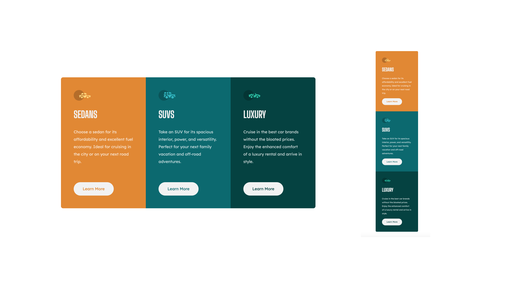

# Frontend Mentor - 3-column preview card component solution

This is a solution to the [3-column preview card component challenge on Frontend Mentor](https://www.frontendmentor.io/challenges/3column-preview-card-component-pH92eAR2-). Frontend Mentor challenges help you improve your coding skills by building realistic projects. 

## Table of contents

  - [The challenge](#the-challenge)
  - [Screenshot](#screenshot)
  - [Links](#links)
  - [Built with](#built-with)
- [Author](#author)

### The challenge

Users should be able to:

- View the optimal layout depending on their device's screen size
- See hover states for interactive elements

### Screenshot

### Links

- Solution URL: [See the solution](https://www.frontendmentor.io/solutions/column-preview-card-using-react-and-tailwind-css-gcSZxfIamZ)
- Live Site URL: [Live site](https://col-prev.lioneltraore.com)

### Built with

- Flexbox
- Grid
- [React](https://reactjs.org/) - JS library
- [Tailwind CSS](https://tailwindcss.com/) - For styles

## Author

- Website - [Lionel Traore](https://lioneltraore.com)
- Frontend Mentor - [@lioneltraore](https://www.frontendmentor.io/profile/yourusername)
- Twitter - [@traore_lionel](https://www.twitter.com/traore_lionel)
